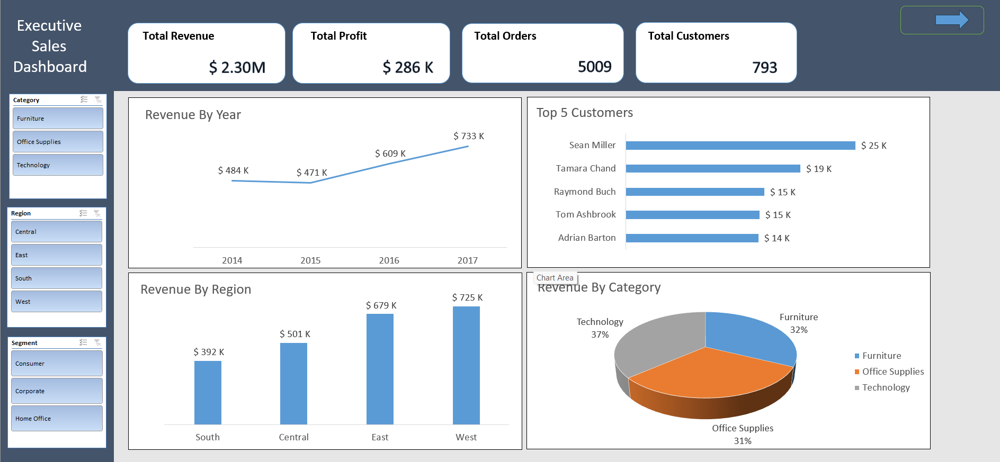
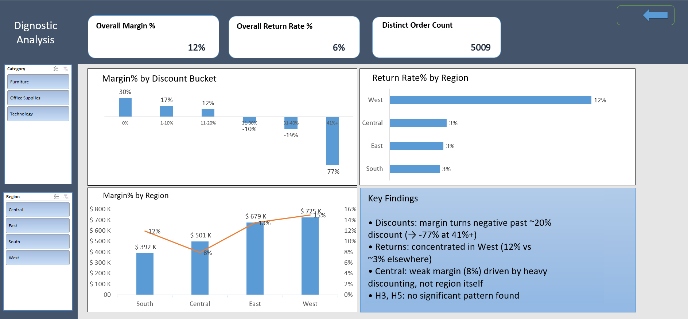

# Retail Profitability Analysis
### 20% Discount Is Where Profit Dies — Here's the Proof

---

## Executive Summary

This project investigates why a retail business with healthy revenue is only converting **12.5%** of it into profit. Starting from a simple company-wide margin check, the analysis narrowed down to a single, actionable root cause: **discounting past a specific threshold is quietly erasing profit on every order it touches.**

Five hypotheses were tested systematically — discounts, returns, regional performance, shipping cost, and shipping method. Three were confirmed with clear evidence; two were ruled out. That combination matters as much as the confirmations: knowing what does *not* drive profitability is what stops a business from chasing the wrong fix.

---

## Tools


---

## Business Context

The starting question was not about discounts at all.
The goal was simply to understand the health of the business: revenue was strong at **$2.30M** across 5,009 orders — but overall margin sat at just **12.5%**, with sharp regional swings underneath it. That gap between "revenue looks fine" and "margin is inconsistent" is what triggered the deeper question:

**What is actually eating the profit — and where, specifically, does it happen?**

Answering that meant refusing to jump straight to charts. Every number in this project had to trace back to a specific, falsifiable hypothesis before it was allowed anywhere near the final dashboard.

---

## The Discovery: A Discount Cliff

| Discount Bucket | Margin % |
|---|---|
| 0% | +30% |
| 1–10% | +17% |
| 11–20% | +12% |
| 21–30% | -10% |
| 31–40% | -19% |
| 41%+ | **-77%** |

Margin doesn't decline gradually — it falls off a cliff. Somewhere between 11–20% and 21–30% discount, orders stop being profitable and start being a direct loss. Past 41% discount, the business is losing more than three-quarters of the sale value on every order in that bucket. This single pattern, confirmed across the full order set, turned out to be the strongest lever in the entire dataset.

---

## Hypothesis Testing

Five hypotheses were tested to understand *where* profitability breaks down.
Each was falsifiable, grounded in business logic, and evaluated against the full 5,009-order dataset.

---

### H1: Higher Discounts Are Associated With Lower Profitability

**Logic:** Discounting is a routine sales lever — but if applied without limits, it can turn a profitable order into a loss-making one.

**Evidence:**

| Discount Bucket | Margin % |
|---|---|
| 0% | +30% |
| 11–20% | +12% |
| 21–30% | -10% |
| 41%+ | -77% |

The breakdown is sharp, consistent, and holds across every region and category. **Hypothesis supported** — the effect is system-wide, not isolated to one segment.

---

### H2: Returns Are Concentrated, Not Evenly Spread

**Logic:** If returns are a random, evenly distributed cost of doing business, there's little to act on. If they're concentrated somewhere specific, there's a targeted fix.

**Evidence:**

| Region | Return Rate % |
|---|---|
| West | 12% |
| Central | 3% |
| East | 3% |
| South | 3% |

West's return rate is roughly **4× every other region**. The pattern is geographic, not tied to any single product line. **Hypothesis supported.**

---

### H3: High Shipping Cost Regions Show Weaker Profitability

**Logic:** Shipping cost eats directly into margin, so markets with higher shipping costs should show measurably weaker profitability.

**Evidence:** Margin percentages across shipping-cost buckets showed no consistent upward or downward trend (28% → 25% → 2% → -12% → 28% → -3% → 14% → 29% → 26% → -2%) — the values move without a discernible pattern tied to cost level.

No monotonic relationship exists. **Hypothesis rejected.**

---

### H4: Some Regions Show Strong Revenue but Weak Profitability

**Logic:** Revenue and profitability don't always move together — a region can look successful on the top line while quietly losing margin underneath.

**Evidence:**

| Region | Sales | Margin % |
|---|---|---|
| West | $725K | 15% |
| East | $679K | 13% |
| South | $392K | 12% |
| Central | $501K | **8%** |

Central generates more revenue than South, yet has the weakest margin of all four regions. Tracing this further showed it isn't a structural regional weakness — it's explained almost entirely by Central's concentration of 41%+ discounts (the same driver identified in H1). **Hypothesis supported.**

---

### H5: Shipping Method Is Associated With Profitability/Return Differences

**Logic:** Faster or more expensive shipping methods could plausibly correlate with different customer behavior or cost structures.

**Evidence:** Margin and return-rate differences across shipping methods (Standard, First Class, Second Class, Same Day) were both under 2 percentage points — well within noise.

**Hypothesis rejected** — shipping method is not a meaningful lever here.

---

## What the Evidence Rules Out

Two rejected hypotheses are not a gap in the analysis — they're part of the answer. They tell the business exactly where *not* to spend effort:

- Shipping cost is not a profitability lever worth optimizing on its own.
- Shipping method is not associated with meaningful differences in margin or returns.

Chasing either would burn time without moving the needle. The real levers are discounting policy and a regional investigation into West's return rate.

---

## Dashboard

A two-page interactive Excel dashboard (Power Pivot–based):

- **Overview** — executive-level KPIs and trends (Revenue, Profit, Orders, Customers) for a general health check
- **Diagnostic** — hypothesis-driven analysis (Margin % by Discount Bucket, Return Rate % by Region, Margin % by Region) with slicers for Category and Region, plus a Key Findings summary card




---

## Recommendations

**Short term:** Set a discount approval threshold at ~20% — discounts above this level should require explicit sign-off rather than routine application, given their consistent association with negative margin.

**Medium term:** Open a targeted operational review of return drivers specifically in the West region, rather than adjusting returns policy company-wide.

**Long term:** Audit discount authorization practices in Central as the most direct, controllable lever to recover its underperforming margin — the region's revenue engine is healthy; its discount discipline is not.

---

## Repository Structure

```
retail-profitability-analysis/
│
├── README.md
├── LICENSE
│
├── dashboard/
│   └── Excel_project2.xlsx        ← full workbook: data, Pivot Tables, DAX measures, dashboard
│
├── report/
│   └── Executive_Summary_Report.pdf
│
└── visuals/
    ├── dashboard-overview.png
    └── dashboard-diagnostic.png
```

## Dataset

**Dataset:** Superstore Sales — a widely used public sample dataset originally shared via the Tableau / Salesforce Trailblazer Community.
**Source:** [Sample - Superstore Sales](https://trailhead.salesforce.com/trailblazer-community/feed/0D5KX00000kQPXv0AO)
**Tables used:** Orders · People · Return · Shipping Cost

Used here strictly for educational and portfolio purposes.

## License

This project is licensed under the MIT License — see [`LICENSE`](./LICENSE) for details.
